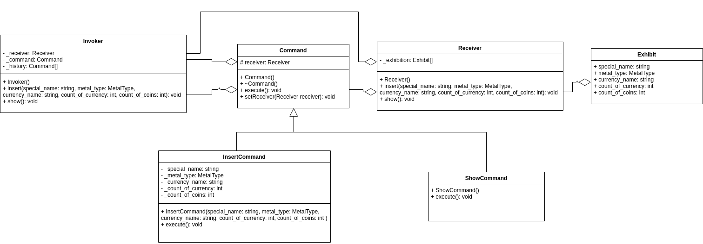

<div align="center">
Министерство науки и высшего образования Российской Федерации <br />
Федеральное государственное бюджетное образовательное учреждение <br />
высшего образования <br />
«Московский государственный технический университет <br />
имени Н.Э. Баумана <br />
(национальный исследовательский университет)» <br />
(МГТУ им. Н.Э. Баумана)
</div>
<hr />
<div align="center">
ФАКУЛЬТЕТ ИНФОРМАТИКА И СИСТЕМЫ УПРАВЛЕНИЯ <br />
КАФЕДРА КОМПЬЮТЕРНЫЕ СИСТЕМЫ И СЕТИ (ИУ6)
</div>
<br />
<div align="center">
ОТЧЕТ <br />
к лабораторной работе №2 <br />
по дисциплине "Современные средства разработки <br />
программного обеспечения" <br />
Реализация типовых решений с применением шаблонов проектирования.
</div>
<br />

Преподаватель: Фетисов М.В.

Студент группы ИУ6-54Б Каташинский Кирилл Юрьевич.

## Описание задания

Задание №10: Шаблон проектирования Command (команда).

Разработать программу командной строки, в которой вывод содержимого коллекции карточек Exhibit осуществлялся бы через задаваемый интерфейс с применением шаблона проектирования Command (команда). Итоговый вариант программы должен быть сохранён в вузовский репозиторий, скомпилирован и проверен с помощью сценария непрерывной интеграции.

## Адрес проекта

Проект хранится в репозитории по адресу: [https://bmstu.codes/lsx/mstd/laboratory-works/l2](https://bmstu.codes/lsx/mstd/laboratory-works/l2).

## Диаграмма классов



Описание классов хранится в репозитории по адресу: [http://lsx.pages.bmstu.codes/mstd/iu6-5-2021/iu6-54b-kykatashinskiy/l2/](http://lsx.pages.bmstu.codes/mstd/iu6-5-2021/iu6-54b-kykatashinskiy/l2/).

## Функция main

```cpp
int main()
{
    Invoker invoker;

    invoker.insert("name3", RARE, "RU", 70, 10);
    invoker.insert("name2", HEAVY, "RU", 60, 20);
    invoker.insert("name1", LIGHT, "RU", 50, 30);

    invoker.show();

    return 0;
}
```

## Выводы

В данной лабораторной работе было произведено знакомство с шаблонами проектирования. Также была написана программа, реализующая паттерн Command (команда).
